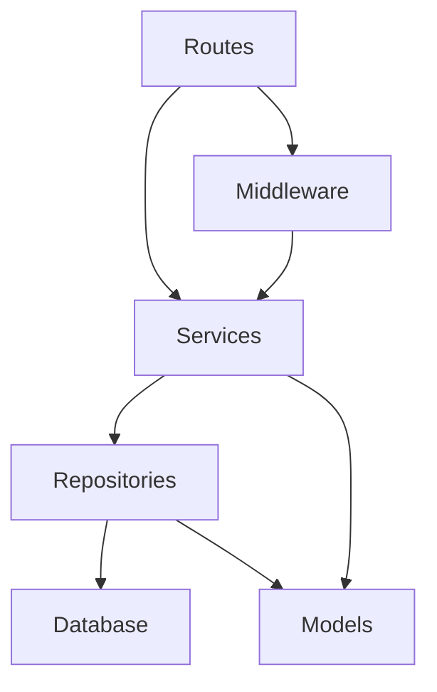

# システムパターン

## アーキテクチャ概要

このアプリケーションは、クリーンアーキテクチャの原則に基づいた階層型アーキテクチャを採用しています。各層は明確な責務を持ち、依存関係は内側に向かって流れるように設計されています。



## ディレクトリ構造

```
src/
├── index.ts         # エントリーポイント
├── db/              # データベース関連
├── libs/            # ライブラリ
├── middleware/      # ミドルウェア
├── models/          # データモデル
├── repositories/    # データベースアクセス
├── routes/          # ルーティング
├── services/        # ビジネスロジック
└── utils/           # ユーティリティ関数
```

## 主要コンポーネント

### 1. ルーティング層 (Routes)

- **責務**: HTTP リクエストの受け付け、レスポンスの返却
- **パターン**: Hono フレームワークを使用したルーターベースの設計
- **特徴**:
  - リソースごとに分割されたルーターファイル
  - ミドルウェアの適用
  - 入力バリデーション
  - サービス層への処理委譲

### 2. サービス層 (Services)

- **責務**: ビジネスロジックの実装
- **パターン**: サービスクラスパターン
- **特徴**:
  - 単一責任の原則に基づく設計
  - リポジトリ層への依存
  - トランザクション管理
  - ドメインルールの適用

### 3. リポジトリ層 (Repositories)

- **責務**: データアクセスの抽象化
- **パターン**: リポジトリパターン
- **特徴**:
  - データベース操作のカプセル化
  - Drizzle ORM を使用したクエリ構築
  - 基本的な CRUD 操作の提供
  - 共通の基底リポジトリクラスを継承

### 4. モデル層 (Models)

- **責務**: データ構造の定義
- **パターン**: TypeScript インターフェースとタイプエイリアス
- **特徴**:
  - データベーススキーマとの連携
  - 入力/出力データの型定義
  - ドメインオブジェクトの表現

### 5. ミドルウェア層 (Middleware)

- **責務**: リクエスト処理の横断的関心事
- **パターン**: チェーン・オブ・レスポンシビリティパターン
- **特徴**:
  - 認証・認可処理
  - リクエスト/レスポンスの変換
  - エラーハンドリング

## 主要なデザインパターン

### 1. 依存性注入パターン

サービスやリポジトリのインスタンス化時に依存関係を外部から注入することで、テスト容易性と疎結合を実現しています。

```typescript
// 例: サービスクラスへのデータベース依存性の注入
export class UserService {
  private repository: UserRepository;

  constructor(db: D1Database) {
    this.repository = new UserRepository(db);
  }

  // メソッド実装...
}
```

### 2. リポジトリパターン

データアクセスロジックをリポジトリクラスにカプセル化し、ビジネスロジックとデータアクセスを分離しています。

```typescript
// 例: 基本的なリポジトリパターンの実装
export class UserRepository {
  constructor(private db: D1Database) {}

  async findById(id: string): Promise<User | null> {
    // データベースアクセスロジック
  }

  // 他のメソッド...
}
```

### 3. ミドルウェアパターン

リクエスト処理のパイプラインを構築し、横断的関心事を分離しています。

```typescript
// 例: 認証ミドルウェア
export const authUserMiddleware = (): MiddlewareHandler => {
  return async (c, next) => {
    // 認証ロジック
    await next();
  };
};
```

### 4. エラーハンドリングパターン

集中型のエラーハンドリングを実装し、一貫したエラーレスポンスを提供しています。

```typescript
// 例: グローバルエラーハンドラー
app.onError((err, c) => {
  // エラータイプに基づいた処理
  return c.json(
    {
      error: {
        /* エラー情報 */
      },
    },
    statusCode
  );
});
```

## データフロー

1. **リクエスト受信**: Hono ルーターがリクエストを受け取る
2. **ミドルウェア処理**: 認証などの横断的処理を実行
3. **ルーターハンドリング**: リクエストパラメータの検証と抽出
4. **サービス呼び出し**: ビジネスロジックの実行
5. **リポジトリアクセス**: データベース操作の実行
6. **レスポンス生成**: 結果データの整形とレスポンス返却

## テスト戦略

- **単体テスト**: サービスとリポジトリの個別テスト
- **統合テスト**: エンドポイントの機能テスト
- **モック**: 外部依存のモック化
- **カバレッジ目標**: 80%以上

## セキュリティパターン

- **認証**: Clerk を使用したトークンベース認証
- **認可**: ミドルウェアによるアクセス制御
- **入力検証**: リクエストデータの検証
- **エラー情報**: 本番環境では詳細なエラー情報を隠蔽
